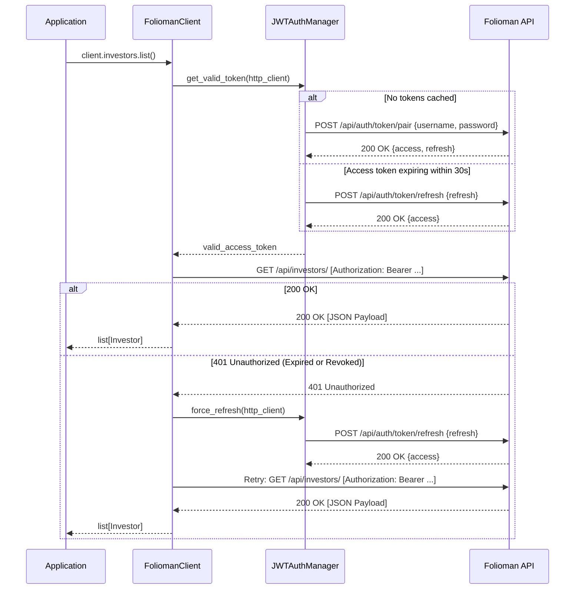

# Authentication

`folioman-client` implements an automated, concurrency-safe JSON Web Token (JWT) lifecycle manager via `JWTAuthManager`. You do not need to manually exchange tokens, manage timers, or handle HTTP 401 retries.

---

## Authentication Flow



---

## Key Authentication Features

### 1. Zero External Dependencies for JWT Parsing

The client parses JWT expiration directly in pure Python using base64 decoding and standard JSON deserialization without relying on bulky cryptography libraries:

- Extracts the `exp` claim from the payload segment (`token.split('.')[1]`).
- Evaluates expiration against UNIX epoch timestamps (`time.time()`).

### 2. Proactive Expiry Absorption (`EXP_SKEW_SECONDS = 30`)

To prevent in-flight requests from failing because a token expired during network transit:

- A token is deemed expired if its remaining lifetime is less than `30` seconds (`EXP_SKEW_SECONDS`).
- When within this window, `get_valid_token()` initiates a proactive refresh via `/api/auth/token/refresh` _before_ issuing the API request.

### 3. Concurrency-Safe Single-Flight Renewal

When multiple async tasks run concurrently, multiple operations might discover an expired token simultaneously.

- An `asyncio.Lock` ensures that only **one** coroutine initiates the refresh or authentication request over HTTP.
- After the lock is acquired, secondary coroutines re-verify the cached access token; if another task has refreshed it, they immediately return the fresh token without redundant network calls.

### 4. Reactive HTTP 401 Recovery

If an unexpected 401 Unauthorized response is received (for instance, if the token was revoked server-side or clock skew exceeded 30 seconds):

1. The client intercepts the 401 status.
2. It executes `await self._auth.force_refresh(client)`.
3. If the refresh succeeds, the request is re-issued with the new token.
4. If refresh fails, it attempts full credential re-authentication at `/api/auth/token/pair`.
5. If both fail, `FoliomanAuthError` is raised.

---

## Authentication Exceptions

All authentication failures raise `FoliomanAuthError` (inheriting from `FoliomanError`). Common causes include:

- **Invalid Credentials**: Incorrect username or password supplied during initial login (`HTTP 401` on `/api/auth/token/pair`).
- **Expired/Invalid Refresh Token**: Both access and refresh tokens are expired or revoked.
- **Malformed Response**: The API failed to return the expected `access` or `refresh` string keys.
- **Network Failures**: Connection dropouts during token acquisition.

### Handling Authentication Errors

```python
import asyncio
from folioman_client import FoliomanClient, FoliomanAuthError


async def main() -> None:
    try:
        async with FoliomanClient(
            base_url="http://localhost:8000",
            username="wrong_user",
            password="wrong_password",
        ) as client:
            await client.investors.list()
    except FoliomanAuthError as exc:
        print(f"Authentication failed: {exc}")


if __name__ == "__main__":
    asyncio.run(main())
```

---

## Unit Testing Authentication with Mocks

When writing unit tests for your application, use `respx` to mock authentication endpoints without transmitting real credentials:

```python
import base64
import json
import time
import httpx
import pytest
import respx
from folioman_client import FoliomanClient


def make_test_jwt(exp_seconds: float) -> str:
    header = base64.urlsafe_b64encode(b'{"alg":"HS256","typ":"JWT"}').decode("ascii").rstrip("=")
    payload = base64.urlsafe_b64encode(
        json.dumps({"user_id": 1, "exp": exp_seconds}).encode("ascii")
    ).decode("ascii").rstrip("=")
    return f"{header}.{payload}.mock_signature"


@pytest.mark.asyncio
async def test_my_service_with_mocked_folioman():
    test_base = "http://folioman.test"
    valid_access = make_test_jwt(time.time() + 3600)
    valid_refresh = make_test_jwt(time.time() + 86400)

    async with FoliomanClient(
        base_url=test_base, username="test", password="test"
    ) as client:
        with respx.mock(base_url=test_base) as respx_mock:
            # Mock authentication endpoint
            respx_mock.post("/api/auth/token/pair").respond(
                200,
                json={"access": valid_access, "refresh": valid_refresh},
            )
            # Mock investor endpoint
            respx_mock.get("/api/investors/").respond(
                200,
                json=[{"id": 1, "name": "Jane Doe"}],
            )

            investors = await client.investors.list()
            assert len(investors) == 1
            assert investors[0].name == "Jane Doe"
```
