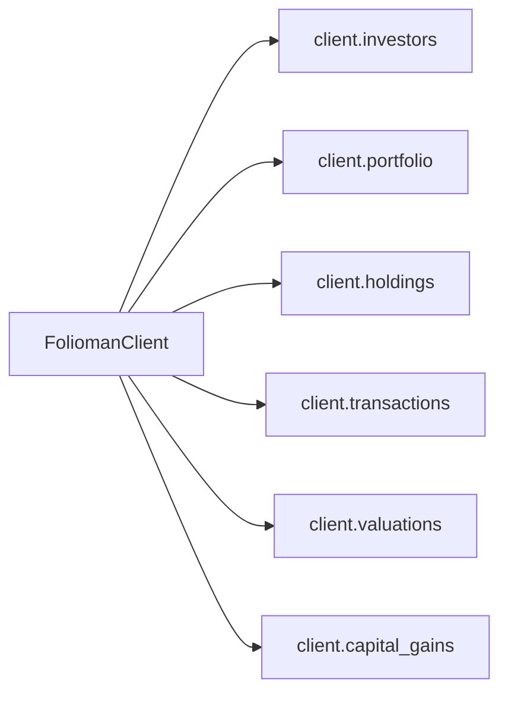

# Client API Reference

The `FoliomanClient` is the primary entry point for interacting with all Folioman REST API resources.

---

## `FoliomanClient` Class

```python
class FoliomanClient:
    def __init__(
        self,
        base_url: str | None = None,
        username: str | None = None,
        password: str | None = None,
        timeout: float = 30.0,
        http_client: httpx.AsyncClient | None = None,
    ) -> None:
        ...
```

### Constructor Parameters

- `base_url` (_str | None_): The base URL of the Folioman REST API (e.g. `"http://localhost:8000"`). If omitted, falls back to `settings.base_url`.
- `username` (_str | None_): The username or advisor account identifier. If omitted, falls back to `settings.username`.
- `password` (_str | None_): The account password or secret token. If omitted, falls back to `settings.password`.
- `timeout` (_float_): Network request timeout in seconds. Defaults to `30.0`.
- `http_client` (_httpx.AsyncClient | None_): An optional pre-configured `httpx.AsyncClient`. When provided, `FoliomanClient` does not close this client on exit, allowing connection pooling across services.

---

## Client Lifecycle & Context Management

`FoliomanClient` manages HTTP connection pools and cached JWT authentication tokens.

```python
async with FoliomanClient.from_env() as client:
    # Operations run within the active connection session
    investors = await client.investors.list()
# Connections are gracefully terminated upon block exit
```

### Methods

#### `from_env()`

```python
@classmethod
def from_env(cls) -> FoliomanClient
```

Factory method that initializes `FoliomanClient` using environment variables.

#### `from_settings(settings)`

```python
@classmethod
def from_settings(cls, settings: FoliomanSettings) -> FoliomanClient
```

Factory method that initializes `FoliomanClient` from a custom `FoliomanSettings` instance.

#### `close()`

```python
async def close(self) -> None
```

Closes the underlying `httpx.AsyncClient` transport if created internally by the client.

#### `request(...)`

```python
async def request(
    self,
    method: str,
    path: str,
    *,
    params: dict[str, Any] | None = None,
    json: Any | None = None,
    headers: dict[str, str] | None = None,
    **kwargs: Any,
) -> Any
```

Low-level dispatcher that injects the authorization Bearer token, prefixes `/api/` automatically if missing, intercepts 401s for automatic renewal/retry, and translates HTTP status codes into structured exceptions.

---

## Resource Sub-Clients

`FoliomanClient` organizes domain operations across six resource sub-clients:



---

### 1. `client.investors` (InvestorsResource)

Endpoints for querying advisor-accessible investors and investor profile details.

#### `list(...)`

```python
async def list(
    self,
    *,
    family_id: int | None = None,
    unaffiliated: bool = False,
) -> list[Investor]
```

Lists investors accessible to the authenticated advisor.

- **Parameters**:
    - `family_id` (_int | None_): Filter investors belonging to a specific family ID.
    - `unaffiliated` (_bool_): If `True`, returns only investors not linked to a family group.
- **Returns**: `list[Investor]`
- **Example**:
    ```python
    investors = await client.investors.list(unaffiliated=True)
    for inv in investors:
        print(inv.id, inv.name)
    ```

#### `get(...)`

```python
async def get(self, investor_id: int) -> InvestorDetail
```

Fetches detailed profile information for an investor, including masked PAN.

- **Parameters**:
    - `investor_id` (_int_): Investor ID.
- **Returns**: `InvestorDetail`
- **Example**:
    ```python
    investor = await client.investors.get(1)
    print(investor.name, investor.pan_masked)
    ```

---

### 2. `client.portfolio` (PortfolioResource)

Endpoints for querying aggregated portfolio summaries, metrics, and asset allocations.

#### `get(...)`

```python
async def get(
    self,
    investor_id: int,
    *,
    as_of: date | str | None = None,
) -> PortfolioSummary
```

Fetches full portfolio metrics, total net worth, day change, XIRR, asset class mix, AMC mix, category breakdown, and holdings list.

- **Parameters**:
    - `investor_id` (_int_): Investor ID.
    - `as_of` (_date | str | None_): Optional point-in-time valuation date (`YYYY-MM-DD` string or `datetime.date`).
- **Returns**: `PortfolioSummary`
- **Example**:

    ```python
    from datetime import date

    summary = await client.portfolio.get(1, as_of=date(2026, 3, 1))
    print(f"Total Valuation: INR {summary.total_inr}")
    print(f"Overall XIRR: {summary.xirr}")
    ```

---

### 3. `client.holdings` (HoldingsResource)

Endpoints for querying priced holdings and individual scheme details.

#### `list(...)`

```python
async def list(
    self,
    investor_id: int,
    *,
    as_of: date | str | None = None,
) -> list[Holding]
```

Returns all priced holdings under an investor (extracted from portfolio summary).

- **Parameters**:
    - `investor_id` (_int_): Investor ID.
    - `as_of` (_date | str | None_): Optional point-in-time date.
- **Returns**: `list[Holding]`
- **Example**:
    ```python
    holdings = await client.holdings.list(1)
    for h in holdings:
        print(f"{h.name} - Units: {h.units} - Value: {h.value_inr}")
    ```

#### `get(...)`

```python
async def get(
    self,
    investor_id: int,
    security_id: int,
    *,
    as_of: date | str | None = None,
) -> SchemeDetail
```

Fetches detailed view of a single scheme holding, including folio balances, full historical NAV points, and transactions.

- **Parameters**:
    - `investor_id` (_int_): Investor ID.
    - `security_id` (_int_): Security / Scheme ID.
    - `as_of` (_date | str | None_): Optional point-in-time date.
- **Returns**: `SchemeDetail`
- **Example**:
    ```python
    scheme = await client.holdings.get(1, security_id=10)
    print(f"Scheme: {scheme.security.name} ({scheme.security.isin})")
    print(f"Historical NAV data points: {len(scheme.nav_history)}")
    ```

---

### 4. `client.transactions` (TransactionsResource)

Endpoints for accessing raw transaction ledgers.

#### `list(...)`

```python
async def list(self, investor_id: int) -> list[Transaction]
```

Returns all transaction ledger records (buys, sells, switches, dividends, STP, SIP) for an investor.

- **Parameters**:
    - `investor_id` (_int_): Investor ID.
- **Returns**: `list[Transaction]`
- **Example**:
    ```python
    txns = await client.transactions.list(1)
    for t in txns:
        print(f"Date: {t.date} | Type: {t.transaction_type} | Units: {t.units} | NAV: {t.nav_or_price}")
    ```

---

### 5. `client.valuations` (ValuationsResource)

Endpoints for historical net-worth series and valuation engine calculation status.

#### `list(...)`

```python
async def list(
    self,
    investor_id: int,
    *,
    from_date: date | str | None = None,
    to_date: date | str | None = None,
    granularity: Literal["daily", "weekly", "monthly"] = "monthly",
) -> ValueSeries
```

Reconstructs net-worth historical time series from transactions and NAV curves.

- **Parameters**:
    - `investor_id` (_int_): Investor ID.
    - `from_date` (_date | str | None_): Start date of the time series.
    - `to_date` (_date | str | None_): End date of the time series.
    - `granularity` (_Literal["daily", "weekly", "monthly"]_): Sampling frequency. Defaults to `"monthly"`.
- **Returns**: `ValueSeries`
- **Example**:
    ```python
    series = await client.valuations.list(
        1,
        from_date="2025-01-01",
        to_date="2026-01-01",
        granularity="monthly",
    )
    for pt in series.points:
        print(f"Date: {pt.date} | Value: INR {pt.value_inr} | Invested: INR {pt.invested_inr}")
    ```

#### `status(...)`

```python
async def status(self, investor_id: int) -> ValuationStatus
```

Queries current calculation readiness and staleness status of the portfolio valuation engine.

- **Parameters**:
    - `investor_id` (_int_): Investor ID.
- **Returns**: `ValuationStatus`
- **Example**:
    ```python
    status = await client.valuations.status(1)
    print(f"Valuation status: {status.status}, Computed through: {status.computed_through}")
    ```

---

### 6. `client.capital_gains` (CapitalGainsResource)

Endpoints for tax reporting and realised capital gains.

#### `list(...)`

```python
async def list(
    self,
    investor_id: int,
    *,
    include_unreconciled: bool = False,
) -> list[CapitalGainsFyPoint]
```

Lists realized STCG and LTCG totals broken down across financial years.

- **Parameters**:
    - `investor_id` (_int_): Investor ID.
    - `include_unreconciled` (_bool_): Whether to include unreconciled transactions.
- **Returns**: `list[CapitalGainsFyPoint]`
- **Example**:
    ```python
    fy_points = await client.capital_gains.list(1)
    for pt in fy_points:
        print(f"FY: {pt.fy} | STCG: INR {pt.stcg} | LTCG: INR {pt.ltcg}")
    ```

#### `get(...)`

```python
async def get(
    self,
    investor_id: int,
    *,
    fy: str,
    include_unreconciled: bool = False,
) -> CapitalGainsReport
```

Fetches realized capital gains report for a specific financial year, including granular disposal lots.

- **Parameters**:
    - `investor_id` (_int_): Investor ID.
    - `fy` (_str_): Financial year string (e.g. `"2024-25"`).
    - `include_unreconciled` (_bool_): Whether to include unreconciled transactions.
- **Returns**: `CapitalGainsReport`
- **Example**:
    ```python
    report = await client.capital_gains.get(1, fy="2024-25")
    print(f"Report for FY: {report.fy}")
    print(f"Total STCG: INR {report.stcg_total} | Total LTCG: INR {report.ltcg_total}")
    for row in report.rows:
        print(f" - {row.name}: Gain: INR {row.gain} ({row.term})")
    ```
