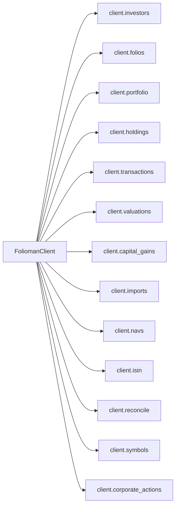

# Python Client SDK

`FoliomanClient` is the primary entry point for embedding Folioman portfolio management into Python applications.

---

## The `FoliomanClient` Class

```python
from folioman_client import FoliomanClient

async with FoliomanClient(
    database_url="sqlite+aiosqlite:///folioman.db",
    user_id="default",
    start_scheduler=False,
) as client:
    ...
```

### Constructor Parameters

| Parameter         | Type          | Default     | Description                                                                                |
| :---------------- | :------------ | :---------- | :----------------------------------------------------------------------------------------- |
| `database_url`    | `str \| None` | `None`      | SQLAlchemy connection URL. If omitted, uses `settings.database_url` or defaults to SQLite. |
| `user_id`         | `str`         | `"default"` | Multi-tenancy tenant or advisor scope identifier.                                          |
| `timeout`         | `float`       | `30.0`      | Network timeout (seconds) for external price feeds.                                        |
| `start_scheduler` | `bool`        | `False`     | If `True`, launches an in-process daemon thread scheduler for 6-hourly NAV refreshes.      |
| `base_url`        | `str \| None` | `None`      | *(Deprecated)* Legacy REST API base URL. See [Backward Compatibility](compatibility.md).  |
| `username`        | `str \| None` | `None`      | *(Deprecated)* Legacy API username for remote JWT authentication.                          |
| `password`        | `str \| None` | `None`      | *(Deprecated)* Legacy API password for remote JWT authentication.                          |
| `mode`            | `str \| None` | `None`      | Execution mode (`"embedded"` or `"remote"`). Inferred from `base_url` if omitted.          |

---

## Resource Sub-Clients

`FoliomanClient` exposes its capabilities through structured resource sub-clients:


```mermaid
graph LR
    Client[FoliomanClient] --> Inv[client.investors]
    Client --> Fol[client.folios]
    Client --> Port[client.portfolio]
    Client --> Hold[client.holdings]
    Client --> Txn[client.transactions]
    Client --> Val[client.valuations]
    Client --> CG[client.capital_gains]
    Client --> Imp[client.imports]
    Client --> Nav[client.navs]
    Client --> ISIN[client.isin]
    Client --> Rec[client.reconcile]
    Client --> Sym[client.symbols]
    Client --> CA[client.corporate_actions]
```

---

### 1. `client.investors`

Manages investor profiles.

#### `list()`

```python
async def list(
    *,
    family_id: int | None = None,
    unaffiliated: bool = False,
) -> list[Investor]
```

Lists all investors belonging to the current `user_id`.

#### `get()`

```python
async def get(investor_id: int) -> InvestorDetail
```

Retrieves detailed profile information for an investor, including masked PAN.

#### `create()`

```python
async def create(
    name: str,
    *,
    pan: str | None = None,
    email: str = "",
    family_id: int | None = None,
) -> InvestorDetail
```

Creates a new investor with an encrypted PAN.

---

### 2. `client.folios`

Manages mutual fund folios and broker demat accounts.

#### `list()`

```python
async def list(investor_id: int) -> list[dict[str, Any]]
```

#### `create()`

```python
async def create(
    investor_id: int,
    number: str,
    *,
    amc_code: str | None = None,
    broker: str | None = None,
) -> dict[str, Any]
```

#### `delete()`

```python
async def delete(investor_id: int, folio_id: int) -> bool
```

#### `merge()`

```python
async def merge(
    investor_id: int,
    source_folio_id: int,
    target_folio_id: int,
) -> dict[str, Any]
```

---

### 3. `client.portfolio`

Retrieves consolidated portfolio valuation, asset allocation, and XIRR.

#### `get()`

```python
async def get(
    investor_id: int,
    *,
    as_of: date | str | None = None,
) -> PortfolioSummary
```

Calculates point-in-time portfolio metrics:

- `total_inr`: Current market value.
- `holdings_count`: Count of active holdings.
- `tax_ready_count`: Count of reconciled positions ready for tax calculations.
- `day_change_inr`: Daily valuation change in INR.
- `xirr`: Money-weighted annualized internal rate of return.
- `asset_mix`: Allocation across Equity, Debt, Cash, etc.
- `top_holdings`: Leading holdings by market value.
- `period_returns`: Trailing performance across standard periods (`1M`, `3M`, `6M`, `1Y`, `3Y`, `5Y`, `ALL`).

---

### 4. `client.holdings`

Queries individual positions and scheme details.

#### `list()`

```python
async def list(
    investor_id: int,
    *,
    as_of: date | str | None = None,
) -> list[Holding]
```

Returns a list of all currently held securities with quantities, market value, invested cost, and scheme-level XIRR.

#### `get()`

```python
async def get(
    investor_id: int,
    security_id: int,
    *,
    as_of: date | str | None = None,
) -> SchemeDetail
```

Returns detailed historical metrics for a single scheme, including transaction ledger, folio breakdowns, and NAV price points.

---

### 5. `client.transactions`

Accesses the raw immutable ledger.

#### `list()`

```python
async def list(investor_id: int) -> list[Transaction]
```

Returns all ledger entries (buys, sells, transfers, dividends) sorted chronologically.

---

### 6. `client.valuations`

Accesses net-worth time-series data.

#### `list()`

```python
async def list(
    investor_id: int,
    *,
    from_date: date | str | None = None,
    to_date: date | str | None = None,
    granularity: Literal["daily", "weekly", "monthly"] = "monthly",
) -> ValueSeries
```

Reconstructs net-worth progression over time from ledger transactions and historical NAVs.

#### `status()`

```python
async def status(investor_id: int) -> ValuationStatus
```

Returns readiness status of the portfolio valuation series.

---

### 7. `client.capital_gains`

Indian tax reporting and Schedule 112A calculations.

#### `list()`

```python
async def list(
    investor_id: int,
    *,
    include_unreconciled: bool = False,
) -> list[CapitalGainsFyPoint]
```

Summarizes realized Short-Term Capital Gains (STCG) and Long-Term Capital Gains (LTCG) across all financial years with disposals.

#### `get()`

```python
async def get(
    investor_id: int,
    *,
    fy: str,
    include_unreconciled: bool = False,
) -> CapitalGainsReport
```

Generates a lot-level capital gains report for a specific financial year (e.g. `"2024-25"`), factoring in Section 112A 2018 grandfathering FMVs and the 23-Jul-2024 Budget regime cutoff.

#### `schedule_112a()`

```python
async def schedule_112a(
    investor_id: int,
    *,
    fy: str,
    include_unreconciled: bool = False,
) -> dict[str, Any]
```

Exports official 15-column Income-tax Schedule 112A dictionary with headers matching the official ITR JSON / CSV utility.

---

### 8. `client.imports`

Ingests statement files.

#### `cas_pdf()`

```python
async def cas_pdf(
    file_path_or_bytes: str | Path | bytes | BinaryIO,
    password: str,
    *,
    investor_id: int | None = None,
    source_ref: str = "",
) -> dict[str, Any]
```

Parses CAMS/KFintech or NSDL/CDSL eCAS PDF statements, normalizes folios, deduplicates transactions via SHA-256 content hashes, and records transactions in the ledger. Returns a summary dictionary containing counts of created/skipped transactions, schemes, and quarantined blocks.

---

### 9. `client.navs`

Manages price feeds.

#### `refresh()`

```python
async def refresh(*, types: list[str] | None = None) -> dict[str, Any]
```

Fetches the latest available NAVs and market closing prices for all held securities.

#### `backfill()`

```python
async def backfill(*, force: bool = False) -> dict[str, Any]
```

Backfills missing historical NAV gaps between the earliest trade date and today.

#### `freshness()`

```python
async def freshness() -> list[dict[str, Any]]
```

Returns price freshness status (`fresh`, `grace`, `stale`, `pending`, `closed`, `no_feed`), lag in trading days, and latest recorded date for all active portfolio securities.

---

### 10. `client.isin`

Manages the reference directory.

#### `seed()`

```python
async def seed(*, force: bool = False, source_path: Path | None = None) -> dict[str, Any]
```

Ingests the bundled offline national reference catalog into the database, populating `ref_schemes`, `ref_isins`, and `ref_grandfathering_navs`.

#### `update()`

```python
async def update() -> bool
```

Downloads and applies updates to `ref_schemes` and `ref_isins` from the remote repository.

#### `status()`

```python
async def status() -> dict[str, Any]
```

Returns current reference dictionary version and statistics.

---

### 11. `client.reconcile`

Manages folio unit integrity and reconciliation checks against statements.

#### `all()`

```python
async def all(*, user_id: str | None = None) -> dict[str, Any]
```

Reconciles all positions across all investors.

#### `investor()`

```python
async def investor(investor_id: int) -> dict[str, Any]
```

Reconciles all security positions for a single investor.

#### `position()`

```python
async def position(
    investor_id: int,
    security_id: int,
    folio_id: int,
) -> SecurityIntegrityStatus | None
```

Reconciles and returns the integrity status for a specific (investor, security, folio) position (`MATCH`, `SNAPSHOT_ONLY`, `LEDGER_ONLY`, `MISMATCH`).

#### `acknowledge()` / `clear()`

```python
async def acknowledge(investor_id: int, security_id: int, folio_id: int) -> dict[str, Any]
async def clear(investor_id: int, security_id: int, folio_id: int) -> dict[str, Any]
```

Manually acknowledges or clears discrepancy flags on mismatched holdings, toggling `tax_safe` status.

---

### 12. `client.symbols`

Exchange trading symbol resolution.

#### `resolve()`

```python
async def resolve(
    *,
    dry_run: bool = False,
    backfill: bool = False,
    force_backfill: bool = False,
) -> dict[str, Any]
```

Resolves missing NSE/BSE ticker symbols from ISIN codes.

---

### 13. `client.corporate_actions`

Corporate actions discovery, inspection, and event application.

#### `refresh()`

```python
async def refresh(
    *,
    security_ids: list[int] | None = None,
    since_year: int = 2016,
) -> dict[str, Any]
```

Fetches stock splits, bonus shares, dividends, and rights announcements from NSE/BSE exchange feeds back to `since_year`.

#### `list()`

```python
async def list(
    *,
    security_id: int | None = None,
    isin: str | None = None,
    symbol: str | None = None,
    kind: str | None = None,
) -> list[dict[str, Any]]
```

Lists cached corporate action announcements matching filter criteria (e.g. `kind="bonus"`, `symbol="TCS"`).

#### `apply()`

```python
async def apply(
    investor_id: int,
    folio_id: int,
    reference_id: int,
) -> dict[str, Any]
```

Applies a specific cached corporate action announcement to an investor folio position.
