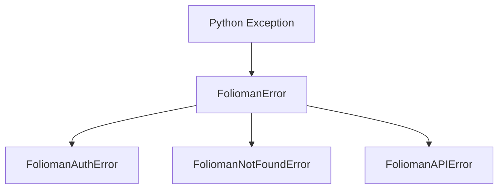

# Error Handling & Exceptions

`folioman-client` provides a focused, predictable exception hierarchy derived from `FoliomanError`. This allows applications to distinguish between network errors, authentication failures, missing resources, and server faults.

---

## Exception Hierarchy



---

## Exception Classes

### `FoliomanError`

```python
class FoliomanError(Exception):
    """Base exception for all Folioman client errors."""
```

The common ancestor of all SDK exceptions. Catching `FoliomanError` guarantees you intercept any client-specific exception.

---

### `FoliomanAuthError`

```python
class FoliomanAuthError(FoliomanError):
    """Raised when authentication fails (invalid credentials, expired/rejected token refresh)."""
```

- **When Raised**:
    - Invalid username or password supplied during initial token pair generation (`HTTP 401` on `/api/auth/token/pair`).
    - Refresh token expired, rejected, or revoked (`HTTP 401` on `/api/auth/token/refresh`).
    - Malformed authentication payload returned by the server.
    - Connection or network failure while requesting tokens.
- **Recommended Action**:
    - Prompt advisor or system operator to re-authenticate or verify credentials.
    - Clear cached tokens or invalidate session state.

---

### `FoliomanNotFoundError`

```python
class FoliomanNotFoundError(FoliomanError):
    """Raised when the requested resource is not found (HTTP 404)."""
```

- **When Raised**:
    - The requested investor ID, security ID, or transaction does not exist (`HTTP 404`).
- **Recommended Action**:
    - Handle missing resources gracefully (e.g. return HTTP 404 to your web client, skip entity processing, or create the record).

---

### `FoliomanAPIError`

```python
class FoliomanAPIError(FoliomanError):
    def __init__(
        self,
        message: str,
        status_code: int,
        response_data: Any | None = None,
    ) -> None:
        ...
```

- **Attributes**:
    - `status_code` (_int_): The exact HTTP status code returned by the server (e.g. `400`, `403`, `422`, `500`).
    - `response_data` (_Any | None_): The parsed JSON payload or raw text string returned by the server detailing the error.
- **When Raised**:
    - Business rule violations (`HTTP 400`).
    - Unprocessable entity validation errors (`HTTP 422`).
    - Upstream server failures or database connectivity issues (`HTTP 500`, `502`, `503`).
    - Response payload is not valid JSON.

---

## Error Handling Examples

### Granular Try/Except Pattern

```python
import asyncio
from folioman_client import (
    FoliomanClient,
    FoliomanAuthError,
    FoliomanNotFoundError,
    FoliomanAPIError,
    FoliomanError,
)


async def fetch_investor_safe(investor_id: int) -> None:
    async with FoliomanClient.from_env() as client:
        try:
            investor = await client.investors.get(investor_id)
            print(f"Loaded: {investor.name}")

        except FoliomanAuthError as exc:
            print(f"Authentication failed: {exc}. Please check your credentials.")

        except FoliomanNotFoundError:
            print(f"Investor with ID {investor_id} does not exist.")

        except FoliomanAPIError as exc:
            print(f"API Error [{exc.status_code}]: {exc}")
            if exc.status_code == 422:
                print(f"Validation details: {exc.response_data}")

        except FoliomanError as exc:
            print(f"Generic Folioman client error: {exc}")

        except Exception as exc:
            print(f"Unexpected application error: {exc}")


if __name__ == "__main__":
    asyncio.run(fetch_investor_safe(9999))
```
