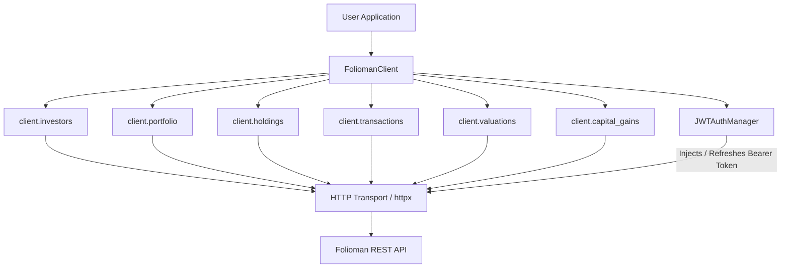

# Folioman Client

[](https://pypi.org/project/folioman-client/)
[](https://pypi.org/project/folioman-client/)
[](https://opensource.org/licenses/MIT)

Typed asynchronous Python SDK for the **Folioman REST API**.

The `folioman-client` library provides a high-performance, asynchronous, and strictly typed interface for financial advisors, wealth management platforms, and algorithmic systems to interact with Folioman services.

!!! important "Service Dependency"
    This client library depends on a running instance of the **[Folioman](https://github.com/codereverser/folioman)** backend service. Ensure your Folioman API server is running and accessible (by default at `http://localhost:8000`, or configured via `base_url` / `FOLIOMAN_BASE_URL`) before connecting.

---

## Key Features

- **Asynchronous Transport**: Built on `httpx.AsyncClient` with native HTTP/2 support, connection pooling, and configurable timeouts.
- **Automated JWT Lifecycle**: Acquires tokens from `/api/auth/token/pair`, refreshes automatically via `/api/auth/token/refresh`, and transparently retries requests on HTTP 401.
- **Concurrency-Safe Renewal**: Coordinates concurrent token refresh operations using an `asyncio.Lock` to guarantee single-flight renewal.
- **Proactive Expiry Absorption**: Parses JWT expiry directly without third-party dependencies and refreshes tokens 30 seconds prior to expiration (`EXP_SKEW_SECONDS = 30`).
- **Pydantic v2 Models**: Deserializes responses into strongly typed models with automatic `Decimal` and `date`/`datetime` serialization handling.
- **Granular Error Handling**: Maps HTTP status codes into intuitive exception classes (`FoliomanAuthError`, `FoliomanNotFoundError`, `FoliomanAPIError`).

---

## Supported Python Versions

`folioman-client` requires **Python 3.11** or newer (tested on Python 3.11, 3.12, 3.13, and 3.14).

---

## Installation

Install using standard Python package managers:

=== "pip"

    ```bash
    pip install folioman-client
    ```

=== "uv"

    ```bash
    uv add folioman-client
    ```

=== "poetry"

    ```bash
    poetry add folioman-client
    ```

---

## Minimal Example

```python
import asyncio
from folioman_client import FoliomanClient


async def main() -> None:
    # Connect using environment variables or direct arguments
    async with FoliomanClient(
        base_url="http://localhost:8000",
        username="advisor",
        password="securepassword",
    ) as client:
        # Fetch list of accessible investors
        investors = await client.investors.list()
        for investor in investors:
            print(f"Investor ID: {investor.id} | Name: {investor.name}")

            # Fetch investor portfolio summary
            portfolio = await client.portfolio.get(investor.id)
            print(f"  Total Portfolio Value: INR {portfolio.total_inr:,.2f}")
            print(f"  Holdings Count: {len(portfolio.holdings)}")


if __name__ == "__main__":
    asyncio.run(main())
```

---

## Architecture Overview



---

## Navigation & Guides

- [Getting Started](getting-started.md): Installation, client lifecycle, and first API requests.
- [Configuration](configuration.md): Environment variables, `.env` files, and `FoliomanSettings`.
- [Authentication](authentication.md): JWT flows, refresh locks, and proactive expiry absorption.
- [Client API](client.md): Deep-dive into all client resources and methods.
- [Models](models.md): Complete reference of Pydantic response models and custom types.
- [Errors](errors.md): Exception hierarchy and robust error handling patterns.
- [Examples](examples.md): Practical end-to-end recipes.
- [API Reference](api-reference.md): Automatically generated API documentation from source code.
- [Development](development.md): Contributing, testing, and building the package.
- [GitHub Repository](https://github.com/sid-146/folioman-client): Issues, source code, and release notes.
